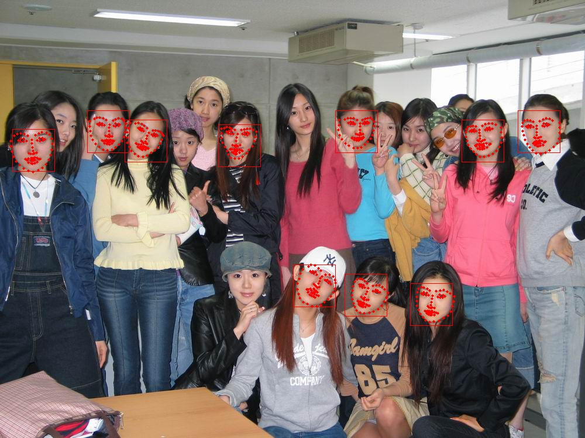

# face-landmark-localization
This is a project predict face landmarks (68 points).Model size is 3.3MB.
- Speed : 5ms per face on i5-2.7GHz CPU.

## Install
- [caffe](https://github.com/BVLC/caffe)
- [dlib face detector](http://dlib.net/)
- add dlib.so to your project lib path
- add face_lardmark.cpp to your caffe project example folder
- opencv

## Usage

- Command : ./face_lardmark

## Result

